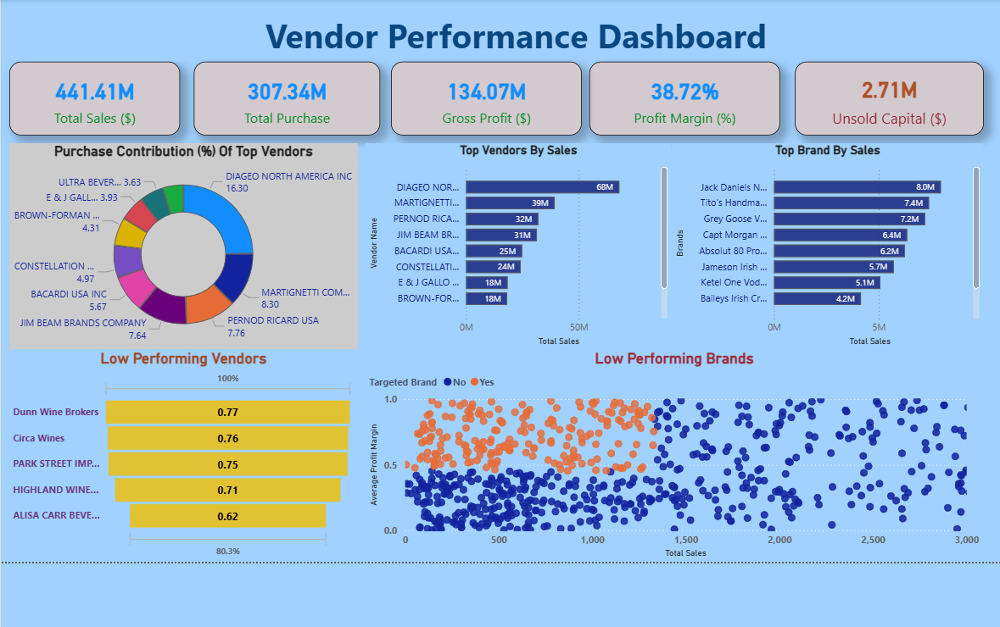

# 📊 Vendor Performance Analytics Dashboard

## 🔎 Project Overview

This project demonstrates an **end-to-end Data Analytics pipeline** built using **Python, MySQL, and Power BI** to analyze vendor performance, inventory efficiency, and profitability.

The solution transforms raw CSV transactional data into meaningful business insights through automated ETL processing and interactive dashboard reporting.

---

## ⚙️ Tech Stack

- **Python** (Pandas, MySQL Connector)
- **MySQL**
- **Power BI**
- **Excel**
- ETL Pipeline Design
- Data Modeling
- Business Intelligence Reporting

---

## 🔄 End-to-End Workflow

1. Raw CSV files ingested using Python  
2. Dynamic MySQL table creation based on schema detection  
3. Batch data insertion with logging and error handling  
4. KPI calculations including:
   - Purchase Contribution %
   - Inventory Turnover
   - Profit Margin %
5. Vendor_Sales_Summary dataset generated  
6. Interactive Power BI dashboard created for business insights  

---

## 📈 Key KPIs Analyzed

- Purchase Contribution %
- Inventory Turnover
- Profit Margin %
- Top Vendors & Brands Performance

---

## 💡 Business Insights

- Identified vendors with inventory turnover < 1 indicating slow-moving stock  
- Highlighted top contributing vendors driving purchase revenue  
- Detected profitability trends across vendor segments  

---

## 📊 Dashboard Preview

